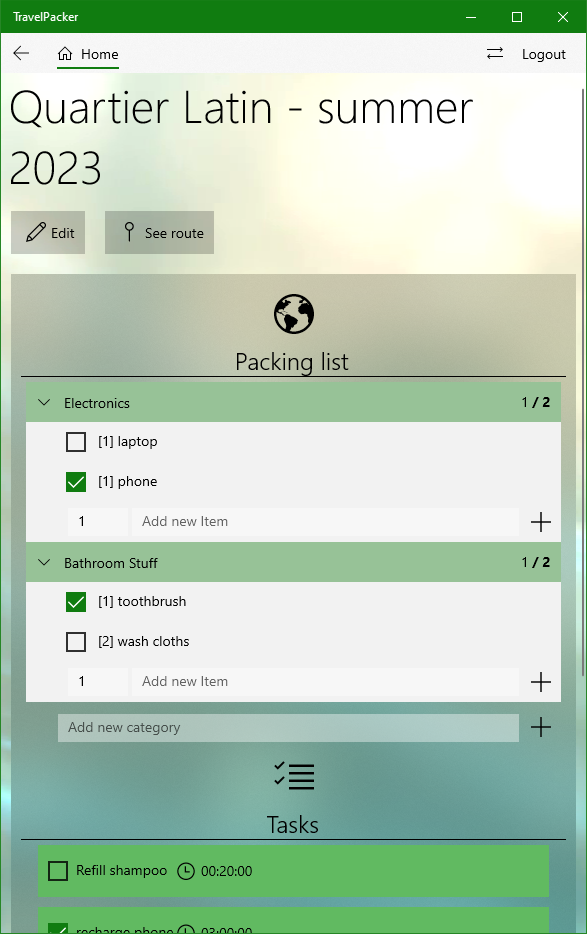

# TravelPacker

Welkom bij de TravelPacker. Dit is de UWP Applicatie als evaluatie voor het vak NativeAppsII-Windows. De applicatie is beschikbaar op desktop en tablet.

### Inloggegevens:

- Student:	
	- email: student@hogent.be
	- paswoord: Root1234
- Prof
	- email: prof@hogent.be
	- paswoord: Root1234
- Zelf registreren kan natuurlijk ook

### Inlog- en Registratiescherm

De applicatie is enkel toegankelijk voor geregistreerde gebruikers. Bij het eerst bezoek aan de service zal u dus een account moeten aanmaken (of gebruik een bovenvermelde testgebruiker). Bij het registreren is het belangrijk dat alle info correct is ingevuld. Zo niet, zal u een melding krijgen. Dit geldt voor alle formulieren in de applicatie.


### Hoofdscherm

Op het hoofdscherm kan u een overzicht van al uw reizen zien. In de linkerbovenhoek kan u kiezen om een reis aan te maken, hierbij wordt u naar een aanmaakformulier omgeleid. 

Bij elke reis ziet u de naam en de locatie van de reis, alsook een leuke foto en een status om in een oogopslag te zien hoe ver u staat met de voorbereiding van de reis.

U kan er ook altijd voor kiezen om een reis te verwijderen. Om dit te doen klikt u met de rechter-muisknop op een reis en selecteert u 'Delete'. Merk wel op dat deze handeling niet ongedaan kan worden. Bij een succesvolle verwijdering, krijgt u een melding.


Om uit te loggen kan u op elk moment in de rechterbovenhoek op 'Logout' klikken. Hierdoor wordt u uitgelogd uit de applicatie en wordt u herleid naar de loginpagina.


### Travel aanmaak- en wijzigingsformulier

Door dit formulier in te vullen, kan u een nieuwe reis beginnen plannen. Bij het wijzigen van een reis, zal het formulier reeds de informatie van de huidige reis bevatten. Deze informatie kan u dan wijzigen.


### Detailscherm 

Op dit scherm ziet u een overzicht van alle items die u nog moet inpakken, taken die u moet volbrengen en een reisroute die de reisplanning beschrijft. U kan items en taken aanmaken om iets niet te vergeten en aanvinken wanneer ze volbracht zijn.

Om elementen te verwijderen, kan u m.b.v. de rechtermuisknop een element selecteren. Er komt een pop-up om de verwijdering te bevestiging.

Voor tabletgebruikers wordt dit overzicht omgevormd naar een overzichtelijke lijst.




### Route

In de service is het ook mogelijk om de route naar uw bestemming te raadplegen. Deze kan u oproepen door op 'Route' te klikken. Waarna de route van uw huidige locatie naar uw eindbestemming berekend wordt, mits de locatie ingeschakeld is en de reis een bestaande locatie heeft.


### Itinerary aanmaakscherm

Op dit scherm kan er een nieuw item aan de reisroute toegevoegd worden. U geeft een start tijd en de geplande duur.


### Task aanmaakscherm

Op dit scherm kan er een nieuwe task aan de todo-lijst toegevoegd worden.


### Belangrijke info voor het runnen

De applicatie maakt gebruik van een databank om de gegevens op te slaan. Er moet dus een connectie-string gedefinieerd worden om connectie te maken met een databank. Verder wordt er ook gebruik gemaakt van authenticatie m.b.v. Bearer-tokens. Om deze tokens te encoderen is er een sleutel nodig die niet op GitHub beschikbaar is.

Om de applicatie succesvol te runnen moet deze info beschikbaar zijn in de user-secrets.json file in het API-project. U kan de onderstaande json knippen en plakken in deze file.

```json
{
  "ConnectionStrings": {
    "DefaultConnection": "Server=(localdb)\\mssqllocaldb;Database=travelpacker_db;Trusted_Connection=True;MultipleActiveResultSets=true"
  },
  "Tokens": {
    "Key": "<plaats hier een lang paswoord (meer dan 30 chars om de veiligheid te garanderen). Dit zal gebruikt worden om de Bearer-tokens te encoderen>"
  }

}
```
Bij het runnen voor de eerste maal moet de database geïnitialiseerd worden. Doe dit door de code op lijn 20 en 21 van DataInitialiser.cs uit commentar te halen en de code op lijn 22 in comentaar te zetten. Hierdoor za de database (opnieuw) geïnitialiseerd worden bij de volgende run.

### Teamleden

- [Simon De Wilde](https://github.com/Simon-De-Wilde) (TI-3C)
- [Kenny Buffel](https://github.com/KennyBuffel) (TI-3C)
- [Marbod Naassens](https://github.com/MarbodNaassens) (TI-3C)
